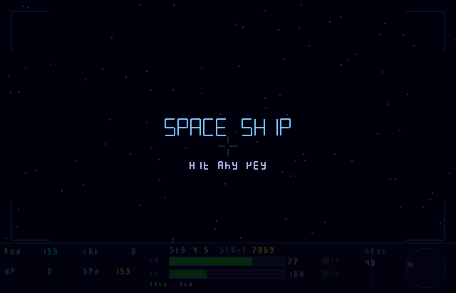
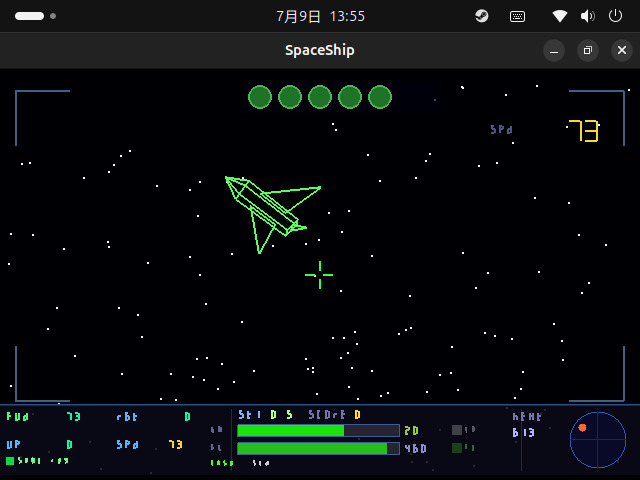
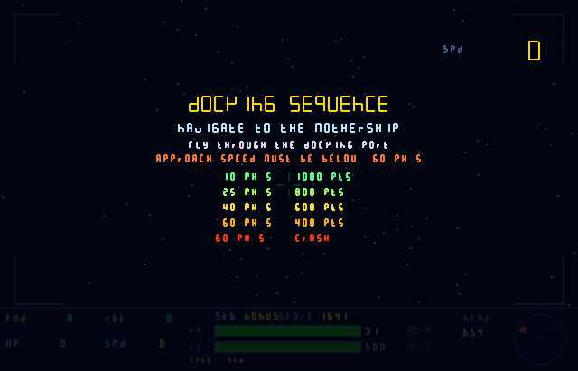
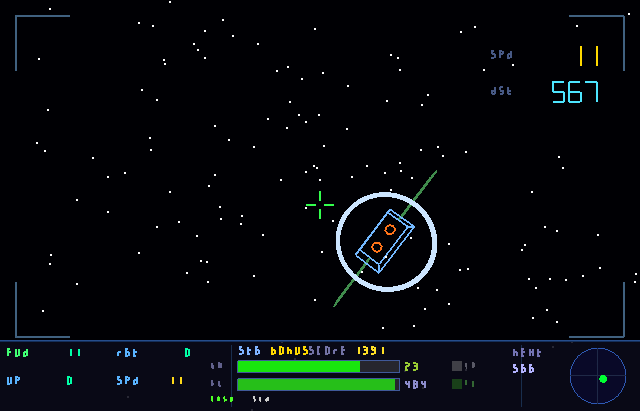
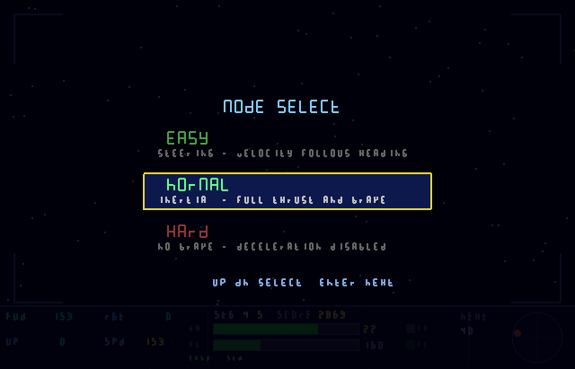
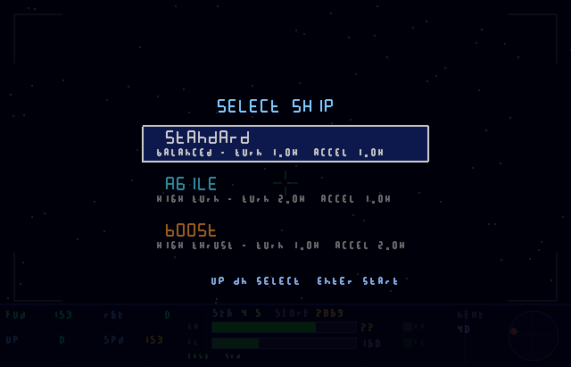

# Space Ship

## 概要

スペースシップはSDL3を使用した宇宙船操縦ゲームです。



## ルールなど

宇宙船を操縦して次々に現れるリングをくぐってください。



リングをくぐると次のリングがランダムな位置に現れます。

与えられた持ち時間以内にリングをくぐってください。
リングをくぐれば残り時間は初期値に戻ります。
宇宙船はスラスターを噴射して進み、燃料が消費されます。
燃料がなくなったりリングに衝突したり所定の時間内にリングをくぐれなければゲームオーバーです。

位相のずれた宇宙空間から謎の宇宙船O-1MOがリングを狙ってやってきます。
O-1MOの宇宙船がリングをくぐるとリングは移動してしまいます。
相手より先にリングをぐってください。
O-1MOの存在する宇宙とは位相がずれており、接触しても衝突は起こりません。
ただしこちらの宇宙船に装備された質量弾はこの宇宙船を破壊することができます。
破壊されると10秒ほどの時間をおいて再出現しますので、このすきをうまく使ってリングを攻略してください。

5つのリングをくぐればステージクリアになり、燃料が補給されます。

2つめのリングをくぐるとどこかにボーナスアイテムが出現します。
燃料切れを回避できるアイテム(緑)と、時間切れを回避できるアイテム(白)です。
取得しなくても問題はありません。

アイテムを持っていると1回限りで時間切れ、または燃料切れを回避できます。
アイテムを消費したら、次回そのアイテムが出現したときに取得可能です。

アイテムを持っている状態でそのアイテムが出た場合はそれはただのボーナスポイントとなります。

この宇宙は慣性の法則が働いており、宇宙船は一度進みだすとその方向の速度が維持された等速直線運動を行います。

カーソルキーで推進軸を上下左右に動かせるので、うまく向きをコントロールして希望する方向への推進力を得てください。

ステージが進むと、回転しているリングや、回転しながら移動するリング、重力を及ぼす中性子星などが登場してゲームの難易度が上がります。

### ボーナスステージ

5面ごとにボーナスステージがあります。



母艦へのドッキングを目指してください。
母艦へのドッキングの際は速度を40以下に落とさないと失敗となります。



### キー操作

* カーソルキー
* ZまたはA
* XまたはB (ハードモードでは使いません)
* SPACEまたはY

カーソルキーで船の向きを上下左右に振ります。
イージーモードでは推進方向も変わりますが、それ以外のモードでは船の向きが変わるだけです。

ZまたはAはアクセルキーで、船の後方へ噴射を行い、向いている方向への加速を行います。
加速は押している間等加速度で行われます。

XまたはBはブレーキで、ハードモードでは機能しません。
推進方向と逆向きに加速度を押している間等加速度で与えます。

船の操作はこれだけです。

SPACEまたはYで質量弾を発射します。
質量弾は現在の宇宙船の進行方向に+100の加速を行って発射され、およそ12秒ほどで自爆します。
この宇宙は閉鎖された空間のため、速度によっては後方から自分に向って飛んでくることもありますので注意してください。
リングにあたるとリングは移動し、スコアが減らされます。
O-1MOの宇宙船を見事破壊すれば加点があります。
中性子星の重力による干渉を受けるので、中性子星がある環境下では弾は曲がります。
同時に二発の質量弾が宇宙空間に存在することはできません。

### ゲームの難易度

宇宙船の操縦難易度は3種類。



* ノーマルモード
* ハードモード
* イージーモード

ノーマルモードが最もスタンダードなモードになります、多分
持ち時間は30秒で、燃料は1000を初期値とします。
宇宙船は船体後方に噴射して加速度を得ます。
向きはカーソルキーで変更できますが、推進方向が変わるわけではありません。
向きを変えて、後方へ噴射をすることで、その時点での速度のベクトルに加えて新たなベクトルが発生し、推進方向や速度が変わります。
ブレーキは現在の推進ベクトルと逆方向に加速する機能で、とりあえず船を止める、あるいは十分に減速し、次の加速を簡単にします。

ハードモードはブレーキ機能がなく、推進軸上後方への噴射機能しかありません。
減速するには宇宙船の向きを反転させて噴射するしかありません。ただし、持ち時間が45秒に伸びます。

イージーモードは、カーソルキーが操舵の役を担います。
要するに、向きを変えれば推進方向も変わります。
最も簡単なモードです。
ただし燃料の初期値が半分になります。

### 宇宙船の種類

宇宙船は3タイプあります。



* 標準型
* 加速度型
* 機動性型

標準型はバランスの取れた機体です。

加速度型は標準型の倍の加速力を持ちます。

機動性型は標準型の倍の方向転換速度を持ちます。

ハイスコアを目指して頑張ってください!

## ビルドと実行

dotnet 10が必要です。

```bash:run
$ git clone https://github.com/wildtree/SpaceShip.git
$ cd SpaceShip
$ dotnet run
```

## Tips

リングの中心付近を通過すると加点があるようです。

燃料残量が30%を切る、残り時間が10病を切る、そのまま進めばリングと衝突する場合には警告が出ますのでうまく操作してください。

ステージが進むと、回転するリングや回転しながら移動するリングなどが出てきます。
難易度が高い分スコアも高いです。

O-1MOは位相空間がずれていますが、重力などの影響は受けます。
また、リングや質量弾は位相をまたいで存在しているので、相互に干渉します。
O-1MOは常にハードモード相当の操縦を要求されており、慣性を考慮しながら運行しています。
技術力の差なのか、彼らの宇宙船の最高速度は当方を下回っているようです。

